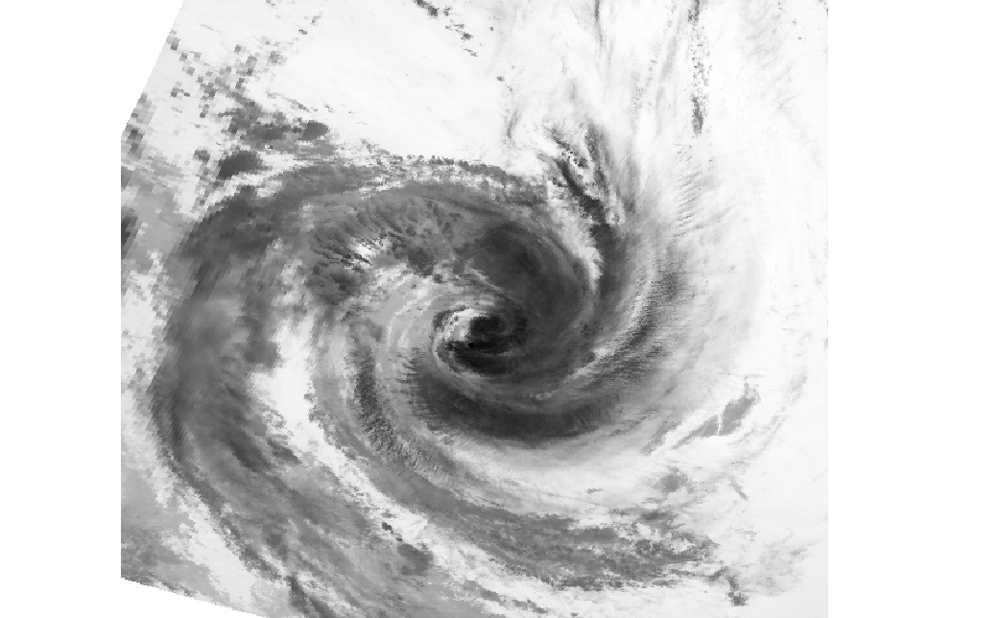

# The Eye of the Storm

Use the provided GeoTIFF ( EPSG:4326, whose bottom left corner is located at 28.047436° N, 78.72188° W) of satellite IR data from Hurricane Bill in 2009 and return the latitude and longitude (in decimal form) of the center point of the storm.  The challenge should be completed using python and be able to perform the calculation in a reasonable amount of time (under 5 minutes).

It is up to you to come up with a suitable algorithm to accomplish this. You may decide to use advanced computer vision or machine learning techniques, or alternatively this task can be completed with a more naive computational heuristic, you decide.  Bonus points for trying something outside the box, unique or clever.

Exercise is scored on correctness first, then on execution wall time on a Google Cloud Platform n1-standard-1 VM.  Please provide a README with install instructions, or better yet a requirements.txt, environment.yml or Dockerfile that creates a repeatable build environment. Data is from HURSAT-AVHRR (https://www.ncdc.noaa.gov/hursat/index.php?name=hursat-avhrr)

